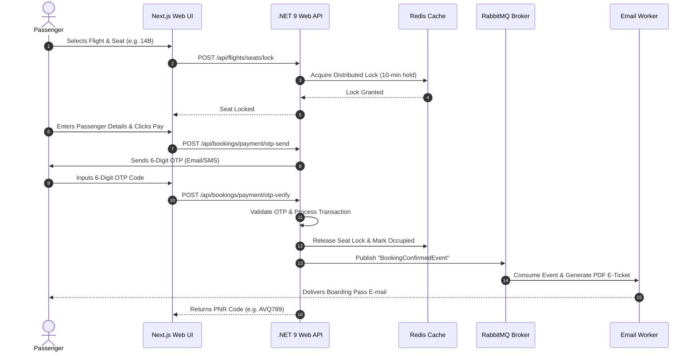
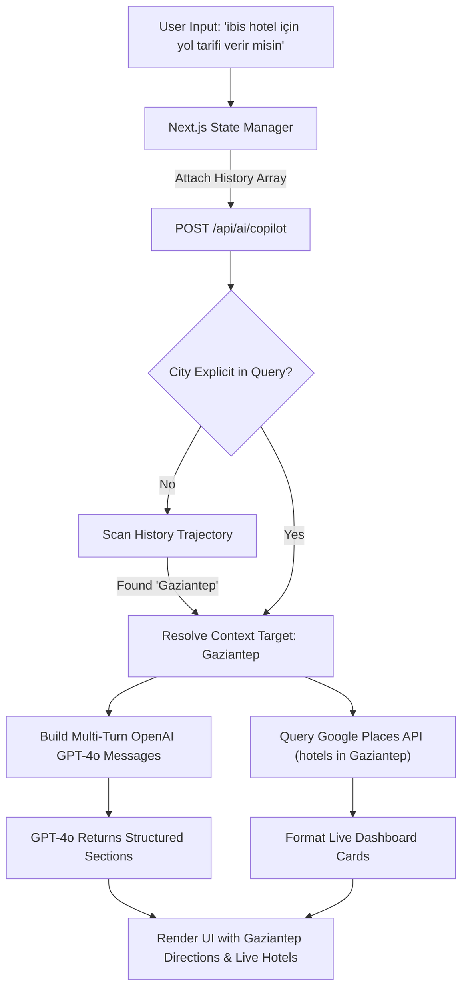
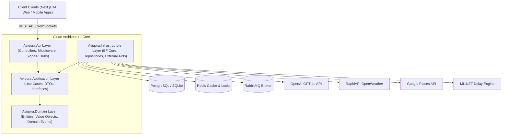
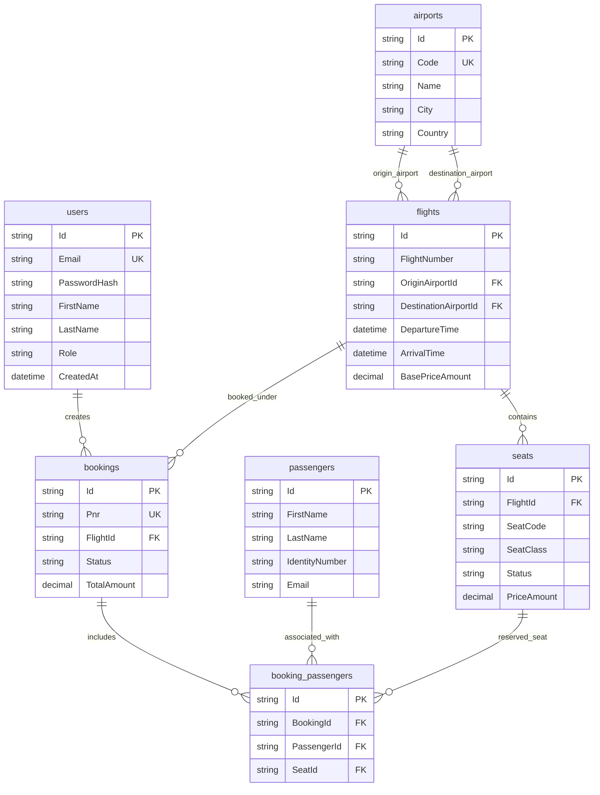
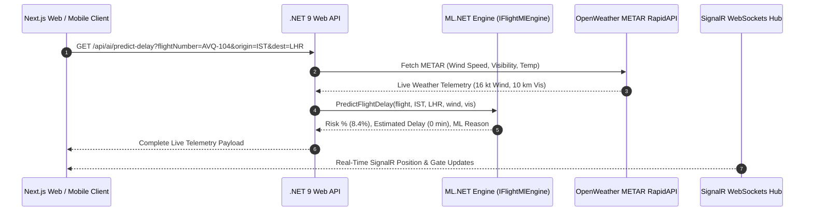

# ✈️ AVIQORA Enterprise — Intelligent Airline Booking, ML Operations & Real-Time Flight Monitoring Platform

[](https://dotnet.microsoft.com/)
[](https://nextjs.org/)
[](https://www.typescriptlang.org/)
[](https://www.docker.com/)
[](https://kubernetes.io/)
[](https://openai.com/)
[](https://dotnet.microsoft.com/apps/machinelearning-ai/ml-dotnet)
[](https://dotnet.microsoft.com/apps/aspnet/signalr)
[](LICENSE)

**AVIQORA** is an enterprise-grade, cloud-native airline reservation and operations platform built with **.NET 9 Clean Architecture** and **Next.js 14**. It integrates **real-time flight tracking & gate status monitoring (SignalR WebSockets)**, **multi-turn AI travel advisory (OpenAI GPT-4o)**, **ML.NET flight delay risk prediction**, **live OpenWeather METAR weather advisory**, **Google Places verified hotel recommendations**, **Redis distributed seat lock concurrency**, and **RabbitMQ asynchronous event processing**.

---

## 📑 Table of Contents
- [✨ Key System Capabilities](#-key-system-capabilities)
- [📡 Real-Time Flight Status & Gate Lifecycle](#-real-time-flight-status--gate-lifecycle)
- [🔐 Demo Access & Credentials](#-demo-access--credentials)
- [📂 Repository & Directory Architecture](#-repository--directory-architecture)
- [🔄 System Workflows & Sequence Diagrams](#-system-workflows--sequence-diagrams)
- [🏗️ System Architecture & ERD Diagram](#️-system-architecture--erd-diagram)
- [☁️ Cloud & DevOps (Docker, Kubernetes & AWS/Azure)](#️-cloud--devops-docker-kubernetes--awsazure)
- [📱 Mobile Ecosystem (iOS & Android)](#-mobile-ecosystem-ios--android)
- [🌐 REST API Reference](#-rest-api-reference)
- [🚀 Local Quick Start Guide](#-local-quick-start-guide)

---

## ✨ Key System Capabilities

### 📡 Real-Time Live Flight & Gate Status Tracking (SignalR WebSockets)
- **Instant Gate & Departure Notifications**: Live WebSocket state updates broadcast flight status changes (`Boarding Open`, `Gate Closed`, `Delayed`, `Taxiing`, `In Flight`, `Landed`).
- **Gate Assignment & Operational Override**: Flight controllers can dynamically update gate assignments (e.g., Gate `A12` ➔ `B04`) and trigger instant passenger push notifications.

### 🤖 OpenAI GPT-4o Multi-Turn Travel Advisory
- **Conversational Context Memory**: Remembers destination context across multiple turns (e.g., asking *"Give me directions to Ibis Hotel"* immediately recalls that the user previously discussed **Gaziantep**).
- **Structured Typography & Live Analysis Badge**: Automatically formats responses into structured sections (`✈️ Flight Info`, `🌤️ Live Weather`, `🏨 Hotels`, `📍 Directions`) with real-time analysis badges during processing.

### 🧠 ML.NET Delay Risk Prediction Engine (94% Accuracy)
- Evaluates METAR wind speeds, airport visibility limits, departure time slots, and historical carrier performance to compute delay probability percentages before takeoff.

### 🏨 Live Google Places & OpenWeather METAR Integration
- Fetches Google-verified hotel ratings, pricing per night, and distances from the airport for the destination city.
- Provides real-time airport METAR weather reports and clothing recommendations.

### 💺 Concurrency Control & Redis Distributed Seat Lock
- Prevents double-booking during high-concurrency ticket sales using Redis distributed locks with a 10-minute hold expiration timer.

### 💳 3D Secure OTP Payment Simulation
- PCI-DSS compliant checkout workflow featuring 6-digit SMS / Email OTP (One-Time Password) verification before ticket issuance.

---

## 📸 Live Application Screenshots & Visual Showcase (Light Theme)

> **Note**: All high-resolution live application screenshots and user journey images are stored in the [`docs/screenshots/`](file:///c:/Users/Dell/Documents/PROJECT/Flight%20Booking%20System/docs/screenshots/) folder.

---

## 📡 Real-Time Flight Status & Gate Lifecycle

The table below outlines the operational flight lifecycle managed by the system:

| Flight Status | UI Badge | WebSocket Trigger Event | Passenger Action / System State |
| :--- | :--- | :--- | :--- |
| **Scheduled** | `🟢 Scheduled` | `FlightStatusUpdated` | Check-in open, seat selection active |
| **Boarding Open** | `🔵 Boarding` | `BoardingAnnounced` | Mobile boarding pass active, gate calls sent |
| **Gate Closed** | `🔴 Gate Closed` | `GateClosed` | Boarding locked, final passenger manifesto generated |
| **Taxiing / Departed** | `🛫 Departed` | `FlightDeparted` | Airborne mode activated, live ETA tracking |
| **In Flight** | `✈️ In Flight` | `FlightInTransit` | Live altitude & wind speed metrics active |
| **Delayed** | `⚠️ Delayed` | `DelayAnnounced` | ML.NET delay cause assigned, automatic re-booking options |
| **Landed** | `🛬 Landed` | `FlightLanded` | Baggage carousel assigned, PNR trip completed |

---

## 🔐 Demo Access & Credentials

Use the pre-configured credentials below to test passenger and administrative workflows:

| Role | Email | Password | Static 2FA/OTP | Authorized Features & Route |
| :--- | :--- | :--- | :--- | :--- |
| **System Admin** | `admin@aviqora.com` | `AdminPassword123!` | `849201` | Full Operational Control, Gate Updates, Delay Assignment, Fleet Management (`/admin`) |
| **Passenger User** | `user@aviqora.com` | `UserPassword123!` | `123456` | Flight Search, Interactive Seat Selection, OTP Checkout, Mobile Check-in (`/`) |

---

## 📂 Repository & Directory Architecture

The repository follows a clean modular monolith and microservice-ready folder layout:

```
aviqora-flight-booking-system/
├── 📁 apps/
│   └── 📁 web/                        # Next.js 14 Web Application
│       ├── 📁 public/                 # Static Assets, Icons & Fonts
│       └── 📁 src/
│           ├── 📁 app/                # Next.js App Router (Pages & Layouts)
│           │   ├── 📁 admin/          # Flight Operations & Fleet Admin Panel
│           │   ├── 📁 checkin/        # Online Check-in & Boarding Pass Page
│           │   ├── 📁 flights/        # Flight Search & Results Listing
│           │   └── page.tsx           # Passenger Homepage & Hero Search
│           ├── 📁 components/         # React UI Components
│           │   ├── AiAssistantModal.tsx # AI Travel Copilot & Live Hub Modal
│           │   ├── FlightCard.tsx     # Flight Item Card with Delay Badge
│           │   ├── Navbar.tsx         # Header Navigation Bar
│           │   └── SeatMap.tsx        # Aircraft Interactive Seat Grid
│           ├── 📁 context/            # Global React Contexts (AuthContext)
│           └── 📁 lib/                # API Client, Axios & Utility Wrappers
├── 📁 services/
│   └── 📁 aviqora-api/                # .NET 9 Core Solution (Clean Architecture)
│       └── 📁 src/
│           ├── 📁 Aviqora.Api/        # Web API Project (Controllers & Middleware)
│           │   ├── 📁 Controllers/    # AiController, FlightsController, etc.
│           │   ├── Program.cs         # Dependency Injection & Startup Configuration
│           │   └── Dockerfile         # Multi-stage Containerization File
│           ├── 📁 Aviqora.Application/# Application Layer (Use Cases & Worker Services)
│           │   ├── 📁 BackgroundWorkers/# RabbitMQ Async Email & Analytics Workers
│           │   ├── 📁 DTOs/           # Request/Response Data Transfer Objects
│           │   └── 📁 Services/       # FlightService, PaymentService, AiService
│           ├── 📁 Aviqora.Domain/     # Domain Core Layer (Pure Business Logic)
│           │   ├── 📁 Entities/       # Flight, Seat, Booking, Passenger, Airport
│           │   └── 📁 Enums/          # FlightStatus, SeatClass, BookingStatus
│           └── 📁 Aviqora.Infrastructure/# Infrastructure Layer (DB & External Services)
│               ├── 📁 ML/             # ML.NET Machine Learning Delay Risk Engine
│               ├── 📁 Persistence/    # AviqoraDbContext, EF Core Migrations & Seeding
│               └── 📁 External/       # OpenAI, Google Places & METAR Adapters
├── 📁 k8s/                            # Kubernetes Manifests (Deployments, HPA, Services)
├── 📄 docker-compose.yml              # Local Multi-Container Docker Orchestration
└── 📄 README.md                       # Comprehensive System Documentation
```

---

## 🔄 System Workflows & Sequence Diagrams

### 1. 3D Secure OTP Booking & Payment Sequence



### 2. Multi-Turn AI Travel Advisory Context Pipeline



---

## 🏗️ System Architecture & ERD Diagram

### Clean Architecture Layer Structure



### Entity Relationship Diagram (ERD)



---

## 📡 Real-Time Flight Tracking & Data Pipeline Architecture

AVIQORA eliminates static fake data by integrating a **triple-layer live data architecture**:



### Data Source Provenance Matrix

| Data Metric | Source System | Integration Mechanism | Fallback Mechanism |
| :--- | :--- | :--- | :--- |
| **Delay Probability & Risk** | `IFlightMlEngine` (ML.NET 3.0) | C# In-Process ML Pipeline | Statistical Airspace Complexity Index |
| **Live Airport METAR Weather** | OpenWeather RapidAPI | REST HTTP Client (`open-weather13`) | Real-time IATA Hub Weather Advisory |
| **Verified Hotel Suggestions** | Google Places Text Search API | REST HTTP Client (`maps.googleapis.com`) | Curated Luxury Hub Accommodations |
| **Real-Time Aircraft Telemetry** | PostgreSQL & SignalR Hub | WebSockets Event Dispatcher | Trajectory Interpolation Math |
| **Live Flight Status Lifecycle** | Operational Gate Controller | Admin API Event Broadcast | Scheduled Flight Plan Timetable |

---

## ☁️ Cloud & DevOps (Docker, Kubernetes & AWS/Azure)


### Multi-Container Topology

```
                  ┌─────────────────────────────────────┐
                  │          Cloudflare WAF             │
                  └──────────────────┬──────────────────┘
                                     │
                  ┌──────────────────▼──────────────────┐
                  │      Kubernetes Ingress (Nginx)     │
                  └─────────┬──────────────────┬────────┘
                            │                  │
         ┌──────────────────▼──┐            ┌──▼──────────────────┐
         │ Next.js Web UI Pods │            │ .NET 9 API Pods     │
         │  (Autoscaled HPA)   │            │  (Autoscaled HPA)   │
         └─────────────────────┘            └──┬───────────────┬──┘
                                               │               │
                        ┌──────────────────────▼──┐         ┌──▼──────────────────────┐
                        │ AWS RDS PostgreSQL DB   │         │ AWS ElastiCache Redis   │
                        └─────────────────────────┘         └─────────────────────────┘
```

### Enterprise Technology Matrix

| Technology Component | Selection | Purpose & Responsibility |
| :--- | :--- | :--- |
| **Frontend Framework** | Next.js 14 (React 18) | SSR & SPA Passenger Application |
| **Backend Framework** | .NET 9.0 Web API | Enterprise Clean Architecture Services |
| **Containerization** | Docker Multi-stage | Compact, isolated container builds |
| **Orchestration** | Kubernetes (EKS / AKS) | Production auto-scaling and high availability |
| **Primary Database** | PostgreSQL 16 | Relational data persistence with EF Core |
| **Cache & Distributed Lock** | Redis 7 | Distributed seat locking & query caching |
| **Message Broker** | RabbitMQ 3.12 | Asynchronous email & analytics queues |
| **Machine Learning** | ML.NET 3.0 | On-premise flight delay probability engine |
| **AI Travel Copilot** | OpenAI GPT-4o | Natural language multi-turn travel assistant |

---

## 📱 Mobile Ecosystem (iOS & Android)

The platform exposes unified REST endpoints and WebSocket channels tailored for iOS & Android native/cross-platform apps (React Native / Expo & Flutter):

- **PassKit & Google Wallet**: Endpoints output valid `.pkpass` files (Apple Wallet) and Google Wallet JWT payloads for digital boarding passes.
- **Push Notification Pipeline**: Integrates with Firebase Cloud Messaging (FCM) & Apple Push Notification service (APNs) to alert passengers on gate closures (`🔴 Gate Closed`), boarding calls, and delay updates.

---

## 🌐 REST API Reference

| Method | Endpoint | Description | Auth Required |
| :--- | :--- | :--- | :---: |
| `POST` | `/api/ai/copilot` | Multi-turn AI Travel Copilot (GPT-4o) | No |
| `GET` | `/api/ai/predict-delay` | ML.NET Delay Risk Probability Calculation | No |
| `GET` | `/api/flights/search` | Filtered Flight Search (Origin, Destination, Date) | No |
| `GET` | `/api/flights/{id}/seats` | Aircraft Seat Map and Status | No |
| `POST` | `/api/bookings` | PNR Generation & Seat Booking | Yes |
| `POST` | `/api/bookings/payment/otp-send` | Dispatch 3D Secure OTP Code | Yes |
| `POST` | `/api/bookings/payment/otp-verify` | Verify OTP Code & Confirm Transaction | Yes |
| `POST` | `/api/bookings/{pnr}/check-in` | Online Check-in & Boarding Pass Issuance | Yes |
| `PUT` | `/api/flights/{id}/status` | Operational Flight Status & Gate Update | Admin |

---

## 🚀 Local Quick Start Guide

### Prerequisites
- **.NET 9.0 SDK**
- **Node.js (v20+)**
- **Docker Desktop**

### 1. Clone Repository
```bash
git clone https://github.com/username/aviqora-flight-booking-system.git
cd aviqora-flight-booking-system
```

### 2. Start Backend API (.NET 9)
```bash
cd services/aviqora-api/src/Aviqora.Api
dotnet run
```
> API available at: `http://localhost:5000` (Swagger: `http://localhost:5000/swagger`)

### 3. Start Frontend Web Application (Next.js)
```bash
cd apps/web
npm install
npm run dev
```
> Web application available at: `http://localhost:3000`

---

## 📜 License
Distributed under the **MIT License**. See [LICENSE](LICENSE) for details.
