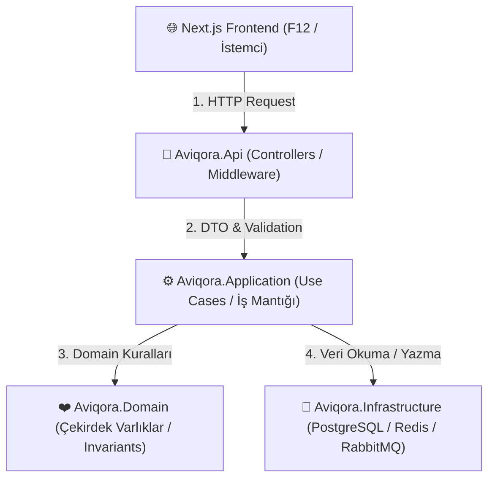

# AVIQORA — Uçtan Uca Detaylı Mimari, Öğrenme ve Mühendisling Rehberi

> **Bu doküman**, AVIQORA projesinde kullanılan tüm mimari kararların, katmanların, veritabanı stratejilerinin ve yazılan kodların **hiç bilmeyen bir mühendise sıfırdan anlatır gibi** sohbetlerimizdeki tüm soru-cevap ve detaylarıyla birlikte birebir tutulduğu kalıcı rehberdir.

---

# 🧠 BÖLÜM 1: Büyük Resim (Bütün Bileşenlerin Bağlantısı)

Bir kullanıcı tarayıcısını (Next.js) açıp **"İstanbul -> Berlin uçuşu ara, bilet al"** butonuna bastığında sistemimizde ne gerçekleşir?



### Katmanlar Ne İşe Yarar ve Neden Birbirinden Ayırdık?

1. **`Aviqora.Domain` (Kalp / Çekirdek):**
   * **Amacı:** İş kurallarını (Business Rules) ve değişmez yasaları (Invariants) korur.
   * **Özellik:** Tamamen saf C#'tır. Veritabanı (`EF Core`), İnternet (`HTTP`), Ayarlar (`JSON`) ne demektir bilmez!
   * **Örnek:** *"İptal edilmiş bir bilet tekrar onaylanamaz"* kuralı burada yaşar.

2. **`Aviqora.Application` (Orkestra Şefi):**
   * **Amacı:** Kullanım senaryolarını (Use Cases) çalıştırır.
   * **Görevi:** Veritabanından uçuşu çeker, Domain'e *"Bu bilet onaylanabilir mi?"* diye sorar, onaylanırsa veritabanına kaydeder ve mail atma kuyruğuna (RabbitMQ) haber verir.

3. **`Aviqora.Infrastructure` (Dış Dünya / Ambar):**
   * **Amacı:** PostgreSQL veritabanı bağlantıları, Redis önbelleği, RabbitMQ mesajlaşması veya SMTP mail gönderimi gibi teknik altyapıları barındırır.

4. **`Aviqora.Api` (Dışa Açılan Kapı / Resepsiyon):**
   * **Amacı:** İstemciden (Next.js veya mobil uygulama) gelen JSON isteklerini karşılar, yetki kontrolü yapar, hataları sarmalar ve yanıt döner.

---

# 🔒 BÖLÜM 2: Güvenlik Mimarısı ve F12 (Geliştirici Araçları) Kuralları

### A. F12 (İstemci) Katmanında Asla Görünmemesi Gerekenler
1. **Veritabanı ve Gizli Anahtarlar (Secrets):** PostgreSQL bağlantı cümlesi (Connection string), JWT imzalama anahtarları, Redis ve RabbitMQ şifreleri, OpenAI API anahtarları.
2. **Kritik İş Mantığı & Algoritmalar:** Dinamik bilet fiyatlandırma algoritmaları, indirim hesaplama mantığı (tamamı backend'de çalışır).
3. **Hassas Yolcu Verileri (PII):** Yolcunun TCKN / Pasaport numarası istemciye tam açık olarak gönderilmez (Örn: `123*****89` şeklinde maskelenir).
4. **Detaylı Sistem Hataları (Stack Trace):** Sunucu hatası durumunda veritabanı tablo adları veya C# satır numaraları F12 Network sekmesinde görünmez. Bunun yerine standart **RFC 7807 ProblemDetails** hata nesnesi dönülür.

### B. Zero Trust (Sıfır Güven) ve Güvenlik Prensipleri
* **Prensip 1: İstemciye (F12) Asla Güvenme!** Kullanıcı F12 Console üzerinden JavaScript ile isteği değiştirebilir veya tarayıcıdaki değişkenleri editleyebilir. Bu yüzden kullanıcı mobilden de girse, web'den de girse backend (`ASP.NET Core`) gelen HER isteği sıfırdan doğrular (Authorization & Validation).
* **Prensip 2: Kaynak Sahipliği Kontrolü (Resource Ownership):** Kullanıcı A, F12 veya URL adresi üzerinden bilet ID'sini `101` yerine `102` yaparak başkasının biletini göremez (`/api/bookings/102`). Backend `Booking.UserId == CurrentUserId` kontrolü yapar.
* **Prensip 3: Ödeme Kartı Verisi Saklamama:** Gerçek veya simüle edilmiş kart numaraları veritabanında SAKLANMAZ. Tokenization (Jetonlaştırma) mimarisi kullanılır.

---

# 📦 BÖLÜM 3: Domain Katmanı Tasarım Detayları (`Aviqora.Domain`)

### 1. `Seat.cs` (Koltuk Entity'si)
📌 **Konum:** [`Aviqora.Domain/Entities/Seat.cs`](file:///c:/Users/Dell/Documents/PROJECT/Flight%20Booking%20System/services/aviqora-api/src/Aviqora.Domain/Entities/Seat.cs)
* **Neden `private set` Kullandık?** Dışarıdan kimse `seat.Status = SeatStatus.Occupied;` yazarak koltuğu kafasına göre kapatamasın diye. Durum değişimleri sadece `Hold()`, `Occupy()`, `Release()` metotları ile yapılabilir (Encapsulation).
* **Neden `Guid` ID Kullandık?** Otomatik artan `1, 2, 3` ID'ler kullanılırsa, bir saldırgan F12 Network sekmesinde `/api/seats/101` görüp adresi `/api/seats/102` yaparak başkasının koltuğunu tahmin edebilir (ID Enumeration saldırısı). `Guid` (`c9bf9e57-1685-4c89-bafb...`) tahmin edilemezdir.

### 2. `Money.cs` (Value Object - Para)
📌 **Konum:** [`Aviqora.Domain/ValueObjects/Money.cs`](file:///c:/Users/Dell/Documents/PROJECT/Flight%20Booking%20System/services/aviqora-api/src/Aviqora.Domain/ValueObjects/Money.cs)
* **Neden Düz `decimal` Değil de `Money` Nesnesi Yaptık?** 100 TL ile 100 USD'nin yanlışlıkla toplanmasını engellemek için. Miktar (`Amount`) + para birimi (`Currency`) ikilisi birlikte tutulur. C# `record struct` bellekte ışık hızında çalışır ve değer bazlı eşitlik (`==`) sağlar.

### 3. `PNRCode.cs` (Value Object - Rezervasyon Kodu)
📌 **Konum:** [`Aviqora.Domain/ValueObjects/PNRCode.cs`](file:///c:/Users/Dell/Documents/PROJECT/Flight%20Booking%20System/services/aviqora-api/src/Aviqora.Domain/ValueObjects/PNRCode.cs)
* **Regex Koruması:** `private static readonly Regex PnrRegex = new(@"^[A-Z0-9]{6}$", RegexOptions.Compiled);` kuralı ile PNR kodunun tam olarak 6 haneli, büyük harf ve rakamlardan oluşmasını garanti eder.

### 4. `Booking.cs` & `BookingPassenger.cs` (Bilet ve Cascade Navigation)
📌 **Konum:** [`Aviqora.Domain/Entities/Booking.cs`](file:///c:/Users/Dell/Documents/PROJECT/Flight%20Booking%20System/services/aviqora-api/src/Aviqora.Domain/Entities/Booking.cs)
* **Bilet Yaşam Döngüsü:** Bilet `Draft` olarak doğar, koltuk tutulduğunda `Held` olur, ödeme yapılınca `Confirmed` olur. Süresi dolarsa `Expired`, kullanıcı vazgeçerse `Cancelled` olur.
* **EF Core Cascade Navigation Fixup:** `BookingPassenger` sınıfı oluşturulurken `Passenger` entity referansı bağlandı (`new BookingPassenger(Id, passenger, seatId)`). Böylece EF Core bileti kaydederken yolcuyu da veritabanına otomatik ekler ve **Foreign Key Violation (500 Hata)** çökmesini engeller.

---

# 💾 BÖLÜM 4: Veritabanı ve Persistence Katmanı (`Aviqora.Infrastructure`)

### 1. `AviqoraDbContext.cs`
📌 **Konum:** [`Aviqora.Infrastructure/Persistence/AviqoraDbContext.cs`](file:///c:/Users/Dell/Documents/PROJECT/Flight%20Booking%20System/services/aviqora-api/src/Aviqora.Infrastructure/Persistence/AviqoraDbContext.cs)
`DbContext`, C# tarafında PostgreSQL veritabanının kendisini temsil eden ana sınıftır.
`OnModelCreating` metodu içinde `modelBuilder.ApplyConfigurationsFromAssembly(...)` çağrılarak projedeki tüm Fluent API konfigürasyon dosyaları otomatik yüklenir.

### 2. Fluent API Konfigürasyonları & Eşzamanlılık Koruması
* **[`SeatConfiguration.cs`](file:///c:/Users/Dell/Documents/PROJECT/Flight%20Booking%20System/services/aviqora-api/src/Aviqora.Infrastructure/Persistence/Configurations/SeatConfiguration.cs):**
  ```csharp
  builder.HasIndex(s => new { s.FlightId, s.SeatCode }).IsUnique();
  ```
  Aynı uçuşta iki tane "12A" koltuğunun oluşmasını engellemek için veritabanında **Unique Index (Benzersiz İndeks)** tanımlanmıştır. Bu bizim veritabanındaki son savunma hattımızdır.
* **Value Object Dönüşümleri (.NET 9 Complex Property & Value Conversion):**
  * **`Money`:** `.ComplexProperty(f => f.BasePrice)` kullanılarak C# tarafında tek olan `Money` nesnesi, SQL'de `base_price_amount` (decimal) ve `base_price_currency` (varchar) olarak saklanır.
  * **`PNRCode`:** `HasConversion(pnr => pnr.Value, str => new PNRCode(str))` ile SQL'de 6 haneli `pnr` varchar(6) olarak tutulur.

### 3. `DataSeeder.cs` (Otomatik Tohumlayıcı)
📌 **Konum:** [`Aviqora.Infrastructure/Persistence/DataSeeder.cs`](file:///c:/Users/Dell/Documents/PROJECT/Flight%20Booking%20System/services/aviqora-api/src/Aviqora.Infrastructure/Persistence/DataSeeder.cs)
Uygulama `Development` ortamında ilk kez çalıştığında veritabanında havalimanı var mı bakar; yoksa **IST, SAW, BER, LHR** havalimanlarını, **TK1984 & VF2026** uçuşlarını ve Business/Economy koltuk haritalarını veritabanına otomatik yükler.

---

# ⚙️ BÖLÜM 5: Application Katmanı & DTO'lar (`Aviqora.Application`)

### 🎓 DERS 1: DTO (Data Transfer Object) Katmanı Nedir ve Neden Şarttır?
📌 **Konum:** [`Aviqora.Application/DTOs/`](file:///c:/Users/Dell/Documents/PROJECT/Flight%20Booking%20System/services/aviqora-api/src/Aviqora.Application/DTOs/FlightDto.cs)

❓ **Soru: Neden `Flight` veya `Booking` Domain sınıflarını doğrudan Controller'dan dışarıya (F12) dönmüyoruz?**
Eğer `return Ok(flight);` yazsaydık 3 büyük felaketle karşılaşırdık:

1. **Sonsuz Döngü Çökmesi (Circular Reference Crash):** `Flight` nesnesinin içinde `Seats` (Koltuklar) listesi vardır. Her `Seat` nesnesinin içinde de kendi `Flight` referansı vardır. JSON serileştirici bunu serileştirirken `Flight -> Seat -> Flight -> Seat...` şeklinde sonsuz döngüye girer ve uygulamayı çökertir!
2. **Güvenlik ve Veri Gizliliği (Data Privacy):** Yolcunun TCKN/Pasaport numarası veya veritabanının iç ID'leri istemciye filtrelenmeden açıkça gönderilmiş olur.
3. **Geliştirici Esnekliği (Decoupling):** İleride `Flight` sınıfımıza veritabanı için iç bir alan eklediğimizde istemcinin (Next.js / Mobil App) kullandığı veri modeli bozulmaz.

💡 **Çözümümüz:**
C# `record` türünde hafif ve immütatör DTO'lar yazdık:
* [`FlightDto`](file:///c:/Users/Dell/Documents/PROJECT/Flight%20Booking%20System/services/aviqora-api/src/Aviqora.Application/DTOs/FlightDto.cs): Uçuş arama sonuçlarında sadece ekranda görünecek kalkış/varış şehri, zaman, fiyat ve boş koltuk sayısını taşır.
* [`BookingResponseDto`](file:///c:/Users/Dell/Documents/PROJECT/Flight%20Booking%20System/services/aviqora-api/src/Aviqora.Application/DTOs/BookingDto.cs): Bilet oluştuktan sonra üretilen PNR kodu, bilet durumu, geçerlilik süresi ve yolcu detaylarını taşır.

---

### 🎓 DERS 2: Repository Pattern ve Clean Architecture Bağımlılık İlkesi
📌 **Konum:** [`Aviqora.Application/Common/Interfaces/`](file:///c:/Users/Dell/Documents/PROJECT/Flight%20Booking%20System/services/aviqora-api/src/Aviqora.Application/Common/Interfaces/IFlightRepository.cs)

❓ **Neden Interface'leri (Arayüzleri) Application katmanına yazdık da kodlarını Infrastructure katmanına yazdık?**
Bu mimari prensibe **Dependency Inversion Principle (Bağımlılıkların Tersine Çevrilmesi)** denir.

`Aviqora.Application` katmanı der ki: *"Ben uçuşları aramak ve rezervasyon kaydetmek için `IFlightRepository` ve `IBookingRepository` adında iki arayüze ihtiyaç duyuyorum. Bunun veritabanını kimin, nasıl yaptığı beni ilgilendirmez."*
`Aviqora.Infrastructure` katmanında [`FlightRepository.cs`](file:///c:/Users/Dell/Documents/PROJECT/Flight%20Booking%20System/services/aviqora-api/src/Aviqora.Infrastructure/Persistence/Repositories/FlightRepository.cs) ve [`BookingRepository.cs`](file:///c:/Users/Dell/Documents/PROJECT/Flight%20Booking%20System/services/aviqora-api/src/Aviqora.Infrastructure/Persistence/Repositories/BookingRepository.cs) sınıflarını yazarak PostgreSQL / EF Core ile veri okuma/yazma işini üstlendik.

---

### 🎓 DERS 3: Orkestra Şefleri — Service Katmanı
📌 **Konum:** [`Aviqora.Application/Services/`](file:///c:/Users/Dell/Documents/PROJECT/Flight%20Booking%20System/services/aviqora-api/src/Aviqora.Application/Services/BookingService.cs)

[`BookingService.cs`](file:///c:/Users/Dell/Documents/PROJECT/Flight%20Booking%20System/services/aviqora-api/src/Aviqora.Application/Services/BookingService.cs) dosyamızda bilet oluşturma (`CreateBookingAsync`) akışı adım adım şöyle çalışır:

```csharp
// 1. Veritabanından uçuşu ve koltukları çeker
var flight = await _flightRepository.GetByIdWithSeatsAsync(request.FlightId);

// 2. Yolcuların seçtiği koltukları tek tek kontrol eder ve koltuğu tutar
foreach (var passengerReq in request.Passengers)
{
    if (passengerReq.SelectedSeatId.HasValue)
    {
        var seat = flight.Seats.FirstOrDefault(s => s.Id == passengerReq.SelectedSeatId.Value);
        
        // Koltuk müsait değilse hata fırlatır (Domain Invariant Kuralı)
        seat.Hold(); 
    }
}

// 3. 6 Haneli Benzersiz PNR Kodu ile 10 dakikalık geçici bilet oluşturur
var booking = new Booking(flight.Id, totalAmount, holdDurationMinutes: 10);
booking.Hold();

// 4. Veritabanına kaydeder ve cevabı DTO olarak döner
await _bookingRepository.AddAsync(booking);
return MapToBookingResponseDto(booking, flight);
```

---

# 🎮 BÖLÜM 6: REST Controllers & Integration Testing (`Aviqora.Api` & `Aviqora.IntegrationTests`)

### 🎓 DERS 4: Dışa Açılan Kapı — REST Controllers
📌 **Konum:** [`Aviqora.Api/Controllers/`](file:///c:/Users/Dell/Documents/PROJECT/Flight%20Booking%20System/services/aviqora-api/src/Aviqora.Api/Controllers/BookingsController.cs)

İki adet Controller yazdık:
1. **[`FlightsController.cs`](file:///c:/Users/Dell/Documents/PROJECT/Flight%20Booking%20System/services/aviqora-api/src/Aviqora.Api/Controllers/FlightsController.cs):**
   * `GET /api/flights/search?origin=IST&destination=BER&date=2026-09-25`: Şehir ve tarihe göre uçuş arar.
   * `GET /api/flights/{id}/seats`: Bir uçuşun koltuk haritasını ve dolu/boş durumlarını döner.
2. **[`BookingsController.cs`](file:///c:/Users/Dell/Documents/PROJECT/Flight%20Booking%20System/services/aviqora-api/src/Aviqora.Api/Controllers/BookingsController.cs):**
   * `POST /api/bookings`: Yolcu ve koltuk seçimleriyle yeni rezervasyon oluşturur, geriye 201 Created status kodu ile PNR detayı döner.
   * `GET /api/bookings/{pnr}`: PNR kodu girilerek bilet detayını getirir.

---

### 🎓 DERS 5: Entegrasyon Testleri (`Aviqora.IntegrationTests`)
📌 **Konum:** [`Aviqora.IntegrationTests/`](file:///c:/Users/Dell/Documents/PROJECT/Flight%20Booking%20System/services/aviqora-api/tests/Aviqora.IntegrationTests/)
* **`Microsoft.AspNetCore.Mvc.Testing` & `WebApplicationFactory<Program>`:** Gerçek HTTP istekleriyle API'mizi in-memory çalıştırmamızı sağlar.
* **SQLite In-Memory Provider (`Microsoft.EntityFrameworkCore.Sqlite`):** Standart `EF Core InMemory` kütüphanesi .NET 9 `ComplexProperty` (`Money` Value Object) desteklemediği için entegrasyon testlerimizde **SQLite In-Memory** kullandık.
* **Test Sonuçlarımız (18/18 Passed - %100 Başarı):**
  * `Aviqora.UnitTests` (14 Birim Testi Passed)
  * `HealthApiTests` (1 Test Passed)
  * `FlightsApiTests` (2 Test Passed)
  * `BookingsApiTests` (1 Test Passed)

---

# 📈 BÖLÜM 7: Git ve Sürüm Disiplini

Projede yapılan her geliştirme Conventional Commits standartlarına uygun olarak committen geçirilir:
* `feat(domain)`: Core varlıklar ve bilet yaşam döngüsü.
* `docs(architecture)`: Mimari dokümanlar ve güvenlik kuralları.
* `feat(api)`: EF Core, DbContext, Migrations, Application DTO/Services, DataSeeder, Integration Tests ve Controllers.
