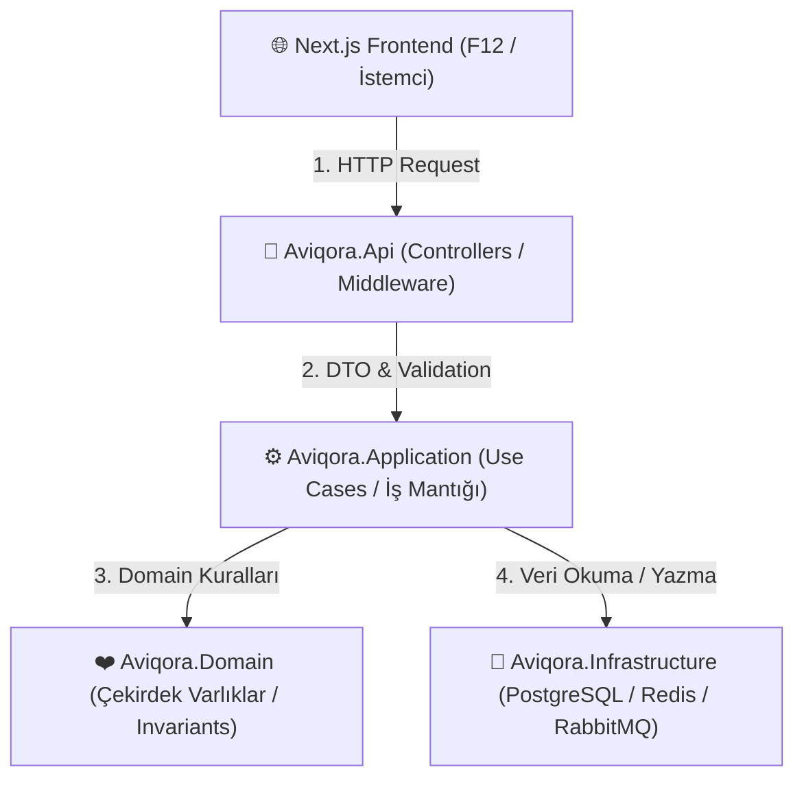

# AVIQORA — Uçtan Uca Detaylı Mimari, Öğrenme ve Mühendislik Rehberi

> **Bu doküman**, AVIQORA projesinde kullanılan tüm mimari kararların, katmanların, veritabanı stratejilerinin ve yazılan kodların **hiç bilmeyen bir mühendise sıfırdan anlatır gibi** sohbetlerimizdeki tüm soru-cevap ve detaylarıyla birlikte birebir tutulduğu kalıcı rehberdir.

---

# 🧠 BÖLÜM 1: Büyük Resim (Bütün Bileşenlerin Bağlantısı)

Bir kullanıcı tarayıcısını (Next.js) açıp **"İstanbul -> Berlin uçuşu ara, bilet al"** butonuna bastığında sistemimizde ne gerçekleşir?



### Katmanlar Ne İşe Yarar ve Neden Birbirinden Ayırdık?

1. **`Aviqora.Domain` (Kalp / Çekirdek):**
   * **Amacı:** İş kurallarını (Business Rules) ve değişmez yasaları (Invariants) korur.
   * **Özellik:** Tamamen saf C#'tır. Veritabanı (`EF Core`), İnternet (`HTTP`), Ayarlar (`JSON`) ne demektir bilmez!
   * **Örnek:** *"İptal edilmiş bir bilet tekrar onaylanamaz"* kuralı burada yaşar.

2. **`Aviqora.Application` (Orkestra Şefi):**
   * **Amacı:** Kullanım senaryolarını (Use Cases) çalıştırır.
   * **Görevi:** Veritabanından uçuşu çeker, Domain'e *"Bu bilet onaylanabilir mi?"* diye sorar, onaylanırsa veritabanına kaydeder ve mail atma kuyruğuna (RabbitMQ) haber verir.

3. **`Aviqora.Infrastructure` (Dış Dünya / Ambar):**
   * **Amacı:** PostgreSQL veritabanı bağlantıları, Redis önbelleği, RabbitMQ mesajlaşması veya SMTP mail gönderimi gibi teknik altyapıları barındırır.

4. **`Aviqora.Api` (Dışa Açılan Kapı / Resepsiyon):**
   * **Amacı:** İstemciden (Next.js veya mobil uygulama) gelen JSON isteklerini karşılar, yetki kontrolü yapar, hataları sarmalar ve yanıt döner.

---

# 🔒 BÖLÜM 2: Güvenlik Mimarısı ve F12 (Geliştirici Araçları) Kuralları

### A. F12 (İstemci) Katmanında Asla Görünmemesi Gerekenler
1. **Veritabanı ve Gizli Anahtarlar (Secrets):** PostgreSQL bağlantı cümlesi (Connection string), JWT imzalama anahtarları, Redis ve RabbitMQ şifreleri, OpenAI API anahtarları.
2. **Kritik İş Mantığı & Algoritmalar:** Dinamik bilet fiyatlandırma algoritmaları, indirim hesaplama mantığı (tamamı backend'de çalışır).
3. **Hassas Yolcu Verileri (PII):** Yolcunun TCKN / Pasaport numarası istemciye tam açık olarak gönderilmez (Örn: `123*****89` şeklinde maskelenir).
4. **Detaylı Sistem Hataları (Stack Trace):** Sunucu hatası durumunda veritabanı tablo adları veya C# satır numaraları F12 Network sekmesinde görünmez. Bunun yerine standart **RFC 7807 ProblemDetails** hata nesnesi dönülür.

### B. Zero Trust (Sıfır Güven) ve Güvenlik Prensipleri
* **Prensip 1: İstemciye (F12) Asla Güvenme!** Kullanıcı F12 Console üzerinden JavaScript ile isteği değiştirebilir veya tarayıcıdaki değişkenleri editleyebilir. Bu yüzden kullanıcı mobilden de girse, web'den de girse backend (`ASP.NET Core`) gelen HER isteği sıfırdan doğrular (Authorization & Validation).
* **Prensip 2: Kaynak Sahipliği Kontrolü (Resource Ownership):** Kullanıcı A, F12 veya URL adresi üzerinden bilet ID'sini `101` yerine `102` yaparak başkasının biletini göremez (`/api/bookings/102`). Backend `Booking.UserId == CurrentUserId` kontrolü yapar.
* **Prensip 3: Ödeme Kartı Verisi Saklamama:** Gerçek veya simüle edilmiş kart numaraları veritabanında SAKLANMAZ. Tokenization (Jetonlaştırma) mimarisi kullanılır.

---

# 🔑 BÖLÜM 3: AuthN vs AuthZ, Şifre Güvenliği ve JWT (JSON Web Token)

### 🎓 DERS 1: AuthN (Authentication) vs AuthZ (Authorization) Nedir?
* **Authentication (Kimlik Doğrulama - AuthN):** *"Sistemdeki kullanıcı kimdir?"* sorusunu yanıtlar (E-posta ve şifre kontrolü, sisteme giriş yapma).
* **Authorization (Yetkilendirme - AuthZ):** *"Bu kullanıcının bu işlemi yapmaya yetkisi var mı?"* sorusunu yanıtlar (Örn: Sadece `Admin` rolündeki kullanıcı yeni uçuş ekleyebilir, `Passenger` sadece kendi biletini görebilir).

---

### 🎓 DERS 2: Şifre Güvenliği — Neden Düz Metin (Plain Text) Şifre Saklanmaz?
📌 **Konum:** [`Aviqora.Infrastructure/Security/PasswordHasher.cs`](file:///c:/Users/Dell/Documents/PROJECT/Flight%20Booking%20System/services/aviqora-api/src/Aviqora.Infrastructure/Security/PasswordHasher.cs)

❓ **Soru: Kullanıcının şifresini veritabanına olduğu gibi kaydedersek ne olur?**
Veritabanı sızdırılırsa tüm kullanıcıların gerçek şifreleri çalınır. Bu yüzden şifreler **PBKDF2 (Password-Based Key Derivation Function 2)** ve **Salt (Tuzlama)** algoritması kullanılarak geri döndürülemez biçimde hash'lenir.

💡 **Nasıl Çalışır?**
```csharp
byte[] salt = RandomNumberGenerator.GetBytes(16); // 16-byte rastgele tuz
byte[] hash = Rfc2898DeriveBytes.Pbkdf2(
    password,
    salt,
    100_000, // 100 bin iterasyon
    HashAlgorithmName.SHA256,
    32);
```
Kullanıcı giriş yaptığında aynı tuz ile girilen şifre hash'lenir ve `CryptographicOperations.FixedTimeEquals` ile zamana duyarlı güvenli karşılaştırma yapılır.

---

### 🎓 DERS 3: JWT (JSON Web Token) Mimarısı ve F12 Kuralı
📌 **Konum:** [`Aviqora.Infrastructure/Security/JwtTokenGenerator.cs`](file:///c:/Users/Dell/Documents/PROJECT/Flight%20Booking%20System/services/aviqora-api/src/Aviqora.Infrastructure/Security/JwtTokenGenerator.cs)

JWT 3 parçadan oluşur: `Header.Payload.Signature`
1. **Header:** Algoritma türü (`HS256`).
2. **Payload:** Kullanıcı ID (`sub`), E-posta (`email`), Rol (`role`), Ad/Soyad ve Son Geçerlilik Süresi (`exp`).
3. **Signature (İmza):** Sunucunun gizli anahtarı (`Jwt:SecretKey`) ile imzalanmış dijital mühürdür.

⚠️ **F12 Güvenlik Uyarısı:**
JWT Payload kısmı Base64 formatındadır ve F12 Network sekmesinde herkes tarafından okunabilir! Bu yüzden JWT içine **ASLA şifre, TCKN veya gizli veriler KOYULMAZ!** İmza sayesinde kullanıcı F12'de kendi rolünü `Passenger`'dan `Admin`'e değiştirmeye çalışırsa imza bozulur ve backend isteği `401 Unauthorized` ile reddeder.

---

### 🎓 DERS 4: Controller Middleware Sıralaması (`Program.cs`)
📌 **Konum:** [`Aviqora.Api/Program.cs`](file:///c:/Users/Dell/Documents/PROJECT/Flight%20Booking%20System/services/aviqora-api/src/Aviqora.Api/Program.cs)

```csharp
// Kimlik Doğrulama (AuthN) -> Yetkilendirme (AuthZ) Sıralaması HAYATİDİR!
app.UseAuthentication(); // 1. Önce kullanıcının JWT Token'ını doğrula (Kimsin?)
app.UseAuthorization();  // 2. Sonra kullanıcının bu endpoint'e yetkisi var mı bak (Neye yetkin var?)
```

---

# 📦 BÖLÜM 4: Domain Katmanı Tasarım Detayları (`Aviqora.Domain`)

### 1. `User.cs` (Kullanıcı Entity'si)
📌 **Konum:** [`Aviqora.Domain/Entities/User.cs`](file:///c:/Users/Dell/Documents/PROJECT/Flight%20Booking%20System/services/aviqora-api/src/Aviqora.Domain/Entities/User.cs)
* Kullanıcının e-posta adresi küçük harfe normalize edilir (`ToLowerInvariant()`), şifre hash'i saklanır ve rolü (`UserRole.Passenger` veya `UserRole.Admin`) belirlenir.

### 2. `Seat.cs` (Koltuk Entity'si)
📌 **Konum:** [`Aviqora.Domain/Entities/Seat.cs`](file:///c:/Users/Dell/Documents/PROJECT/Flight%20Booking%20System/services/aviqora-api/src/Aviqora.Domain/Entities/Seat.cs)
* **Encapsulation (`private set`):** `seat.Status = Occupied` şeklinde dışarıdan müdahaleye kapalıdır. Durum değişimleri sadece `Hold()`, `Occupy()`, `Release()` metotları ile yapılabilir.
* **`Guid` ID Kullanımı:** Otomatik artan `1, 2, 3` ID'ler yerine `Guid` kullanılır (ID Tahmin/Enumeration saldırılarını engellemek için).

### 3. `Money.cs` (Value Object - Para)
📌 **Konum:** [`Aviqora.Domain/ValueObjects/Money.cs`](file:///c:/Users/Dell/Documents/PROJECT/Flight%20Booking%20System/services/aviqora-api/src/Aviqora.Domain/ValueObjects/Money.cs)
* Miktar (`Amount`) + para birimi (`Currency`) ikilisini birlikte tutar. C# `record struct` bellekte ışık hızında çalışır ve değer bazlı eşitlik (`==`) sağlar.

### 4. `PNRCode.cs` (Value Object - Rezervasyon Kodu)
📌 **Konum:** [`Aviqora.Domain/ValueObjects/PNRCode.cs`](file:///c:/Users/Dell/Documents/PROJECT/Flight%20Booking%20System/services/aviqora-api/src/Aviqora.Domain/ValueObjects/PNRCode.cs)
* `private static readonly Regex PnrRegex = new(@"^[A-Z0-9]{6}$", RegexOptions.Compiled);` kuralı ile PNR kodunun tam olarak 6 haneli, büyük harf ve rakamlardan oluşmasını garanti eder.

### 5. `Booking.cs` & `BookingPassenger.cs` (Bilet ve Cascade Navigation)
📌 **Konum:** [`Aviqora.Domain/Entities/Booking.cs`](file:///c:/Users/Dell/Documents/PROJECT/Flight%20Booking%20System/services/aviqora-api/src/Aviqora.Domain/Entities/Booking.cs)
* Bilet `Draft` -> `Held` -> `Confirmed` -> `Expired` / `Cancelled` yaşam döngüsüne sahiptir.
* `BookingPassenger` oluşturulurken `Passenger` entity referansı bağlandığı için EF Core bileti kaydederken yolcuyu veritabanına otomatik ekler.

---

# 💾 BÖLÜM 5: Veritabanı ve Persistence Katmanı (`Aviqora.Infrastructure`)

### 1. `AviqoraDbContext.cs`
📌 **Konum:** [`Aviqora.Infrastructure/Persistence/AviqoraDbContext.cs`](file:///c:/Users/Dell/Documents/PROJECT/Flight%20Booking%20System/services/aviqora-api/src/Aviqora.Infrastructure/Persistence/AviqoraDbContext.cs)
PostgreSQL ile C# varlıklarımız arasındaki ana köprüdür. `DbSet<User>`, `DbSet<Flight>`, `DbSet<Booking>` tablolarını yönetir.

### 2. Fluent API Konfigürasyonları & Eşzamanlılık Koruması
* **[`UserConfiguration.cs`](file:///c:/Users/Dell/Documents/PROJECT/Flight%20Booking%20System/services/aviqora-api/src/Aviqora.Infrastructure/Persistence/Configurations/UserConfiguration.cs):** `Email` sütunu üzerinde **Unique Index** tanımlanmıştır. Aynı e-posta ile iki kez kayıt yapılması veritabanı seviyesinde engellenir.
* **[`SeatConfiguration.cs`](file:///c:/Users/Dell/Documents/PROJECT/Flight%20Booking%20System/services/aviqora-api/src/Aviqora.Infrastructure/Persistence/Configurations/SeatConfiguration.cs):** `HasIndex(s => new { s.FlightId, s.SeatCode }).IsUnique()` ile aynı uçuşta çift koltuk oluşması engellenir.

### 3. `DataSeeder.cs` (Otomatik Tohumlayıcı)
📌 **Konum:** [`Aviqora.Infrastructure/Persistence/DataSeeder.cs`](file:///c:/Users/Dell/Documents/PROJECT/Flight%20Booking%20System/services/aviqora-api/src/Aviqora.Infrastructure/Persistence/DataSeeder.cs)
Uygulama kalktığında veritabanında havalimanı var mı bakar; yoksa **IST, SAW, BER, LHR** havalimanlarını, **TK1984 & VF2026** uçuşlarını ve koltuk haritalarını veritabanına otomatik yükler.

---

# ⚙️ BÖLÜM 6: Application Katmanı, Services & Controllers

### 1. DTO Katmanı (`Aviqora.Application/DTOs/`)
* **`AuthDto.cs`:** `RegisterRequestDto`, `LoginRequestDto`, `AuthResponseDto`.
* **`FlightDto.cs` & `BookingDto.cs`:** İstemciye dönülecek filtrelenmiş veriler.

### 2. Service & Repository Akışları
* **`AuthService.cs`:** Kayıt esnasında e-posta mükerrerlik kontrolü yapar, şifreyi PBKDF2 ile hash'ler, kullanıcıyı veritabanına kaydeder ve JWT Token üretir.
* **`FlightService.cs` & `BookingService.cs`:** Uçuş arama ve bilet oluşturma iş akışlarını yönetir.

### 3. REST Controllers (`Aviqora.Api/Controllers/`)
* **`AuthController.cs`:** `POST /api/auth/register` ve `POST /api/auth/login`.
* **`FlightsController.cs`:** `GET /api/flights/search` ve `GET /api/flights/{id}/seats`.
* **`BookingsController.cs`:** `POST /api/bookings` ve `GET /api/bookings/{pnr}`.

---

# 🧪 BÖLÜM 7: Entegrasyon Testleri (`Aviqora.IntegrationTests`)

📌 **Konum:** [`Aviqora.IntegrationTests/`](file:///c:/Users/Dell/Documents/PROJECT/Flight%20Booking%20System/services/aviqora-api/tests/Aviqora.IntegrationTests/)
* **`AuthApiTests.cs`:** Kullanıcı kaydı ve giriş yapma akışını HTTP üzerinden test eder.
* **SQLite In-Memory Provider:** EF Core 9 `ComplexProperty` uyumlu ilişkisel in-memory veritabanı.
* **Test Sonuçlarımız (19/19 Passed - %100 Başarı):**
  * `Aviqora.UnitTests` (14 Birim Testi Passed)
  * `AuthApiTests` (1 Test Passed)
  * `HealthApiTests` (1 Test Passed)
  * `FlightsApiTests` (2 Test Passed)
  * `BookingsApiTests` (1 Test Passed)

---

# 📈 BÖLÜM 8: Git ve Sürüm Disiplini

Projede yapılan her geliştirme Conventional Commits standartlarına uygun olarak committen geçirilir:
* `feat(domain)`: Core varlıklar ve bilet yaşam döngüsü.
* `docs(architecture)`: Mimari dokümanlar ve güvenlik kuralları.
* `feat(auth)`: JWT authentication, PBKDF2 password hashing, AuthController ve Auth integration testleri.
